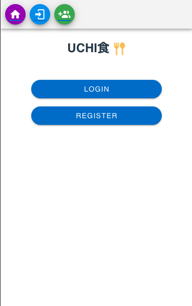
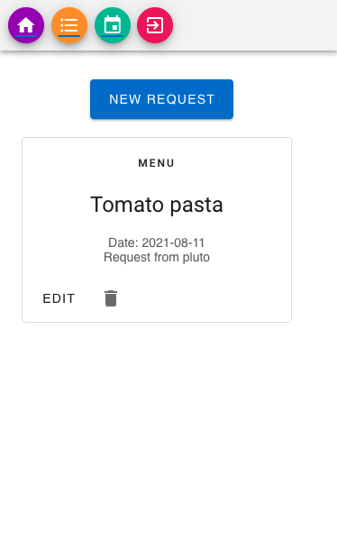
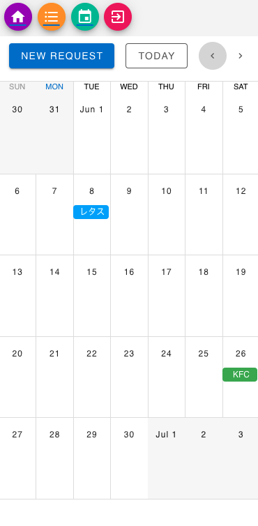

# UCHI SHOKU

This is an app that I created during the time as students at Code Chrysalis.
<br>
https://book-dinner-project.firebaseapp.com/about

<p align="center">Login</p>
<p align="center"></p>
<br>
<p align="center">Request</p>
<p align="center"></p>
<br>
<p align="center">Calendar</p>
<p align="center"></p>


## Purpose of this app

UCHI SHOKU aims to make the communication easier between an eater and a cooker at home. The eater can request what he/she wants to eat for the dinner while the cooker can know what kind of ingredients are needed for requests. Basically, the cooker has the right to decide which request to accept.  
<br>
<br>

## Instructions
### To run the app locally 
1. Install all dependencies
    ```
    $ yarn/npm install
    ```

2. Run the app locally
    ```
    $ yarn/npm run serve
    ```

3. Checkout `http://localhost:8080` on your browser :D

<br>
<br>

## Current Features and Operation
Currently the app is in an early stage and it's functionality is still limited.

Users can:
 - Register an account (either as an eater or cooker)
 - Login
 - Check accepted requests on the calendar

    `Eater`
    - Send a request
    - Edit a request
    - Delete a request

    `Cooker`
    - Send a request
    - Edit a request
    - Delete a request
    - Accept a request
<br>
<br>

## Future Features
 - Group Authentication
 - Importing recipes from external APIs
